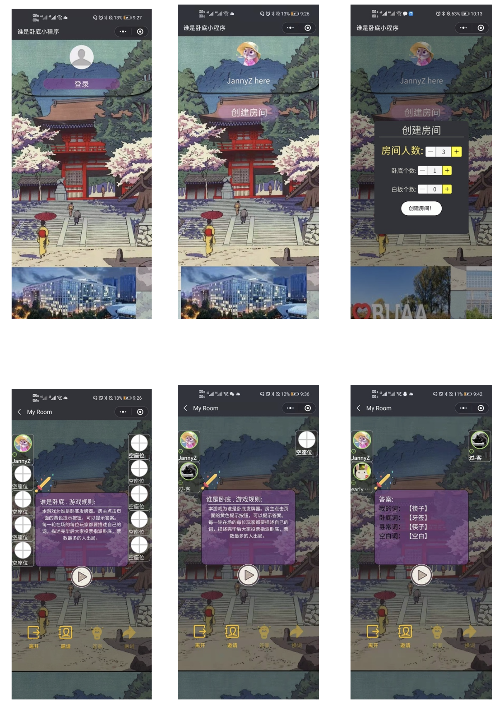
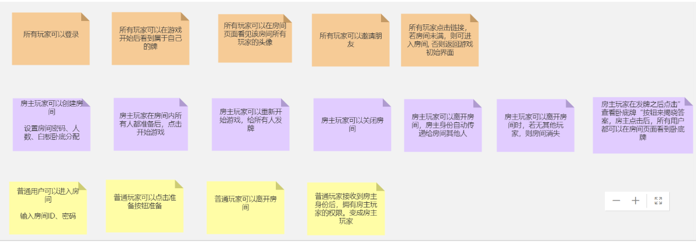
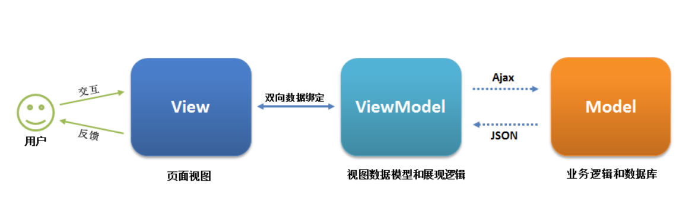
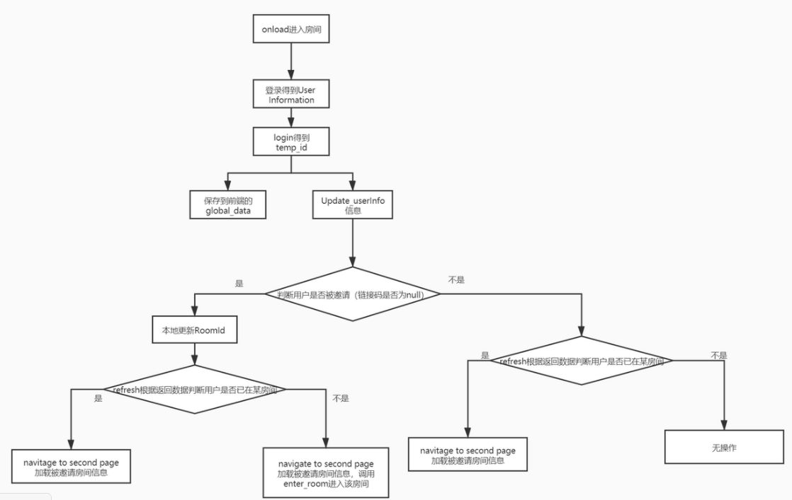
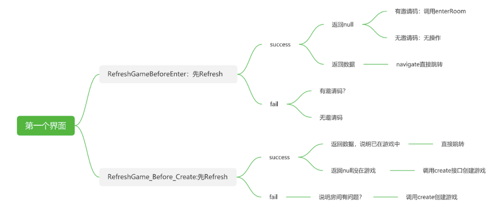

# 程序界面展示



# 1 Quick Start

- node.js环境安装

- 安装依赖 npm 或者yarn

  ```powershell
  npm install 
  or 
  yarn install
  ```

- 调试

  ```shell
  # 进入到wechat开发的文件夹里
  $ npm run dev 
  or
  yarn dev 
  ```

- 使用小程序开发者工具打开项目下的 `dist/[target]` 目录。

  打开后，点击开发者工具右上角，可以设置小程序版本号。

  选择在测试版进行调试，调试之后点击上传，就能在开发版进行测试。测试人的添加需要在微信公众平台进行添加和赋权。


# 2 微信开发者工具的使用

1. 下载微信开发者工具

2. 在微信公众平台创建APPID，填写小程序的各种信息。（不选择测试号）

3. 在powershell中使用create-remax-app脚手架创建一个基础项目框架。

   - ```shell
     npx create-remax-app my-app
     ```

4. 打开微信开发者工具，选择dict文件打开

###### 微信小程序的其他功能：

微信开发者工具可以选择真机调试、上传、修改小程序信息（app_ID等），但编译软件使用的还是VScode


# 3 用户故事




# 4 架构与技术总述

Web前端为基于Remax框架的单页面应用。UI采用了anna-remax-ui，以及wechat自带的一些基础组件



#### 4.1 前端本地的数据

接口规范见后端设计文档。本地会暂存一些数据和变量，以便组件的渲染和对后端的传递。

##### 1 用户全局信息

```js
const [globalData,setGlobalData]= React.useState({
    userInfo:null,
    id:null,
});
```

```
type UserInfo struct {
 ID         int64     `json:"id" gorm:"column:id"`                   // 自增ID
 OpenId     string    `json:"openid" gorm:"column:openid"`           // openid，和微信接口的字段名一致
 NickName   string    `json:"nickName" gorm:"column:nick_name"`      // 用户昵称
 Gender     int       `json:"gender" gorm:"column:gender"`           // 用户性别
 AvatarUrl  string    `json:"avatarUrl" gorm:"column:avatar_url"`    // 用户头像
 City       string    `json:"city" gorm:"column:city"`               // 用户城市
 Province   string    `json:"province" gorm:"column:province"`       // 用户省份
 Country    string    `json:"country" gorm:"column:country"`         // 用户国家
 Language   string    `json:"language" gorm:"column:language"`       // 用户语言
 CreateTime time.Time `json:"create_time" gorm:"column:create_time"` // 创建时间
 UpdateTime time.Time `json:"update_time" gorm:"column:update_time"` // 更新时间
}
```

##### 2 创建房间设置的信息

```js
const [roomSetting, setRoomSetting] = React.useState({ 
	spy_num:0,
    blank_num:0,
    total_num:0, // nums of rooms
})
```

##### 3 房间具体信息

```js
  const [roomInformation, setRoomInfo] = React.useState(
    { roomId:"", 
      roomInfo:{
        begin_player: "",
        room_setting: {spy_num:1,blank_num:1,total_num:7},
        master_open_id:"", // string 房主的open_id
        player_list:[
          {open_id:"000000",nick_name:"user0",avatar_url:"null",state:"Ready",word:"word1",role:"Normal",number:0},], // player[] : open_id,nick_name,avatar_url, state, word, role, number
        state:"Ready", // enum[Open, Wait, Ready, Playing]
        word:{
          id:"01", // string
          normal:"word1", // string
          spy:"word2", // string
          blank:"", // string
        },
        word_cache:[],//此房间已经玩过的词汇列表
      }
    }
  );


```


##### 4 判断用户是否在游戏中的变量

```js
const [onGame, setOnGame] = React.useState(false); // 判断用户是否在游戏中，若在，则再次进入房间时，不回产生请求
```


#### 4.2 同后端的交互——request

请求的data数据：（接口所需数据皆是JSON格式。需将传输的数据转成纯字符串格式，再进行加密，将这两部分合成一个JSON）

```js
let reqDataJsonString = JSON.stringify(data); // 需要传输的data必须是字符串的形式
let temp_data = {
    "data": reqDataJsonString,
    "sign": md5.hexMD5( ... ), // 加密
}
```

```js
wx.request({
        url: url,
        header: header,
        data: temp_data,
        method: 'POST',
        success: function (res) {
            if (res.data.Success) {
				//成功接收但是请求出错的函数回调
            } else {
				//成功接收但是请求出错的函数回调
            }
        },
        fail: function () {
            //接受失败的函数回调
        }
    })
```


#### 4.3 异步的解决办法：

由于对后端的请求相对复杂，请求之间需要保证一定的相对顺序，因此多次会涉及多次回调。为了美化多次回调的代码风格，采用Promise来实现请求的同步。

```js
// wxGetUserInfo是定义的一个promise函数，里面有resolve,reject两个函数，分别传递成功的值和失败的值
wxGetUserInfo.api.requestApi(1)
      .then(res_userInfo => { // res_userInfo是wxGetUserInfo传递resolve的值
    	return new Promise((resolve, reject) => {
            resolve(a); // a将作为下一个then的res参数
            reject(b); // 失败是返回的值
        }
      })
      .then(res => {
        // res是上一个函数传递resolve来的信息
      })
      .catch(res => {
      //失败回调函数   
      })
```


#### 4.4 快速响应

​	由于涉及到用户之间的同步与异步，当有新用户进入房间后，需要及时通知其他人员，因此后端房间的数据变化需要及时传递给前端。前端使用一个`setInterval`与`clearInterval（interval）`函数来实现定时向后端轮询数据。

​	其他的方法还有WebSocket，但并未尝试。	

​	由于setInterval之间是互不干扰的线程，因此容易多启动多个interval, 所以在每次创建interval之前都将上一个interval删除，再创建新interval。

```js
function startInter(){
    if(interval){
        clearInterval(interval);
        interval = null;
    }
    interval = setInterval(refreshGame,1100);//启动计时器，调用overs函数，
    console.log("启动轮询访问--");
}
```


#### 4.5 Remax /（React）的及时渲染

remax使用的是基于react的框架，因此一些语法可以完全沿用过来。hook以及TODO涉及到的参数的改变都会导致页面的重新渲染。

###### react中的参数传递——Hook：（限于本页面）

- [基础 Hook](https://zh-hans.reactjs.org/docs/hooks-reference.html#basic-hooks)

- - [useState](https://zh-hans.reactjs.org/docs/hooks-reference.html#usestate)
  - [useEffect](https://zh-hans.reactjs.org/docs/hooks-reference.html#useeffect)
  - [useContext](https://zh-hans.reactjs.org/docs/hooks-reference.html#usecontext)

```js
const [text, setText] = React.useState('');
setCount(3) // 然后直接调用这个方法就可以直接赋值给text了
```

###### react中的参数传递——TODO：（父子页面之间传递，当父改变，子界面的该参数也随之改变）

# 5 代码逻辑



第一个界面重点方法逻辑：



 
